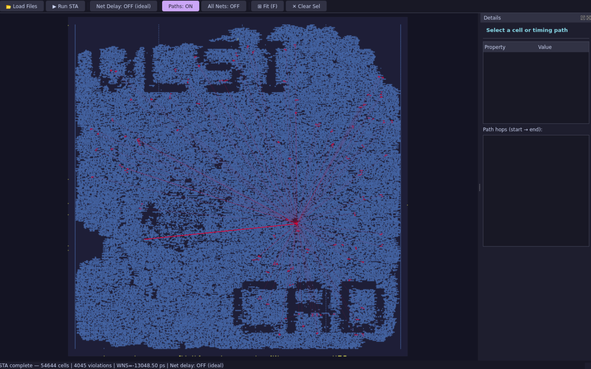
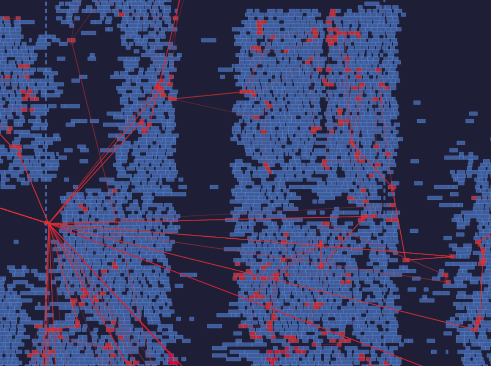

# Easy STA

A Python-based **Static Timing Analysis (STA)** engine and **interactive layout viewer** for ASAP7 designs from the ISPD 2026 contest.

> **Disclaimer — Educational / Demo use only**
> This project is intended as a **learning resource** to demonstrate how the core steps of Static Timing Analysis are implemented in a straightforward, readable way — from liberty parsing and timing graph construction to delay propagation and slack computation.
> It is **not** designed for production or engineering use. Many simplifications are made intentionally (ideal clock, lumped-RC net delay, setup-check only, no ECO flow, etc.) to keep the code approachable and easy to follow.

## Demo


*Full layout view of `jpeg_encoder_v2` — 54644 cells, 4045 timing violations, WNS = −13048.50 ps (ideal wire mode)*


*Close-up: red cells are on violating timing paths; red arrows show the critical data-flow direction*

It builds a timing graph from a Yosys JSON netlist, propagates delay/slack with wire RC estimation, and renders the placed layout with color-coded timing paths in a Qt GUI.

---

## Features

- Parse clock and I/O timing constraints from SDC
- Load multi-library ASAP7 liberty files (with pickle cache)
- Build a timing graph from a Yosys-style JSON netlist
- Propagate cell delay (from liberty lookup tables) and net delay (lumped RC model)
- Toggle between **ideal wires** (net delay = 0) and **RC wire model** at runtime
- Interactive Qt layout viewer:
  - Draw die area and all placed cells at their correct DEF positions
  - Cell sizes read from LEF (no fixed-size approximation)
  - Color-coded cells and timing paths: red (violation) → yellow (near-zero) → green (slack)
  - Click any cell → see arrival time, slew, load, slack in detail panel
  - Click any timing path → see endpoint slack and full hop list
  - Right-drag to pan, scroll wheel to zoom, **F** to fit
  - Toggle visibility of timing paths and all net connections

---

## Repository Layout

| File | Purpose |
|------|---------|
| `main.py` | CLI entry point (STA + TCL output) |
| `build_graph.py` | Timing graph construction from JSON netlist |
| `parse_sdc.py` | SDC parser (`create_clock`, I/O delay, uncertainty) |
| `read_lib.py` / `parse_lib.py` / `parse_cell_db.py` | Liberty loading and cell DB |
| `timing_graph.py` / `timing_node.py` | Graph data structures |
| `propagation.py` | Delay/slack propagation core |
| `read_def.py` | DEF parser (wire-length estimation, used by CLI) |
| `read_def_extended.py` | Extended DEF parser (die area, net topology, port positions) |
| `parse_cell_rank.py` | Gate ranking CSV loader |
| `gui_viewer.py` | Qt interactive layout + timing viewer |
| `openroad_interface.py` | Optional persistent OpenROAD process wrapper |
| `gate_ranking_all_cells_analysis.csv` | Cell sizing rank table |
| `raw_libs.pkl` | Auto-generated liberty cache (created on first run) |

---

## Requirements

- Python 3.8+
- Linux (tested on Ubuntu 20.04)
- ASAP7 liberty files under `ISPD26-Contest/Platform/ASAP7/lib/`
- ASAP7 LEF files under `ISPD26-Contest/Platform/ASAP7/lef/` (for GUI cell sizes)

```bash
python3 -m venv venv
venv/bin/pip install -r requirements.txt
```

---

## Preparation

### Convert Verilog → Yosys JSON (first time per testcase)

```bash
docker run -d --name yosys \
  -v /path/to/ISPD26-Contest:/work \
  hdlc/yosys sleep infinity

docker exec yosys yosys -p \
  "read_verilog /work/aes_cipher_top/TCP_250_UTIL_0.40/contest.v; \
   hierarchy -auto-top; \
   write_json /work/aes_cipher_top/TCP_250_UTIL_0.40/aes_cipher_top_netlist.json"
```

### Build the liberty cache (first run only)

The cache `raw_libs.pkl` is generated automatically on the first call to any script that loads libraries. Subsequent runs load from cache instantly.

---

## Usage

### CLI — STA + TCL sizing output

```bash
venv/bin/python main.py \
  <json_file> <top_module> <sdc_file> <def_file> <output_tcl_file>
```

**Example (aes_cipher_top):**

```bash
venv/bin/python main.py \
  ISPD26-Contest/aes_cipher_top/TCP_250_UTIL_0.40/aes_cipher_top_netlist.json \
  aes_cipher_top \
  ISPD26-Contest/aes_cipher_top/TCP_250_UTIL_0.40/contest.sdc \
  ISPD26-Contest/aes_cipher_top/TCP_250_UTIL_0.40/contest.def \
  --no-net-delay
```

### GUI — Interactive layout viewer

```bash
# With file dialogs
source venv/bin/activate
python3 gui_viewer.py

# Pre-load from CLI (module name auto-detected from JSON)
python3 gui_viewer.py \
  ISPD26-Contest/aes_cipher_top/TCP_250_UTIL_0.40/aes_cipher_top_netlist.json \
  ISPD26-Contest/aes_cipher_top/TCP_250_UTIL_0.40/contest.sdc \
  ISPD26-Contest/aes_cipher_top/TCP_250_UTIL_0.40/contest.def
```

> **Display requirement:** The GUI needs an X11 or Wayland display. If connecting over SSH, use `ssh -X` (Mac: install XQuartz; Windows: install VcXsrv or use WSLg).

#### GUI Controls

| Action | Input |
|--------|-------|
| Pan | Right-drag |
| Zoom | Scroll wheel |
| Fit entire layout | **F** key |
| Select cell / path | Left-click |
| Clear selection | Toolbar → ✕ Clear Sel |
| Toggle net delay (RC ↔ ideal) | Toolbar → **Net Delay** button (re-runs STA) |
| Show/hide timing paths | Toolbar → **Paths** button |
| Show/hide all net lines | Toolbar → **All Nets** button |

#### Color coding

| Color | Meaning |
|-------|---------|
| Red | Negative slack (timing violation) |
| Yellow | Near-zero slack |
| Green | Positive slack (timing margin) |
| Gold dot | Primary I/O port |

---

## Delay Modeling

### Cell Delay

Cell delay is looked up from liberty timing tables using **input slew** and **output load capacitance**.
The output load is computed as the sum of all fanout pin capacitances (`Cpin`) only — wire capacitance (`Cwire`) is **not** included in the cell delay calculation.

### Net Delay

This project is intended as a demo of the STA computation flow, so net delay uses a simplified **lumped-RC model** derived from RMST wire length:

```
delay (ps) = 0.5 × R × C
R = wire_length_µm × 20 Ω/µm   (average M1–M4 resistance)
C = wire_length_µm × 0.2 fF/µm  (average M1–M4 capacitance)
```

Toggle **Net Delay: OFF** in the GUI to zero all net delays and observe ideal-wire slack. STA re-runs automatically on toggle.

---

## Troubleshooting

| Error | Fix |
|-------|-----|
| `No module named 'liberty'` | Run with `venv/bin/python3` or `source venv/bin/activate` |
| `No module named 'PyQt5'` | `venv/bin/pip install PyQt5` |
| `No Qt platform plugin "xcb"` | Connect via `ssh -X` or start a VNC session |
| `Module X not found in JSON` | Use `aes_cipher_top_netlist.json`, not `aes_cipher_top.json` (config file) |
| `No libraries loaded` | Check ASAP7 liberty files exist under `ISPD26-Contest/Platform/ASAP7/lib/` |
| Cells still overlapping in GUI | LEF files not found — check `ISPD26-Contest/Platform/ASAP7/lef/` exists |

---

## Known Limitations

- Setup check only (no hold analysis)
- Clock tree not modeled (ideal clock assumed)
- SRAM macro sizes may fall back to default if not in standard cell LEF
